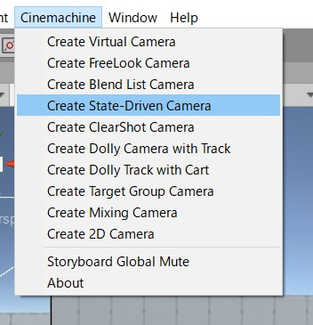
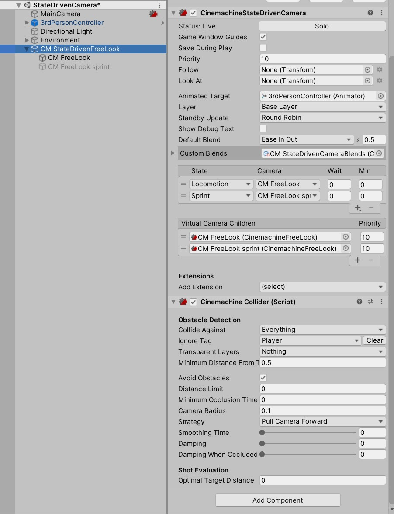
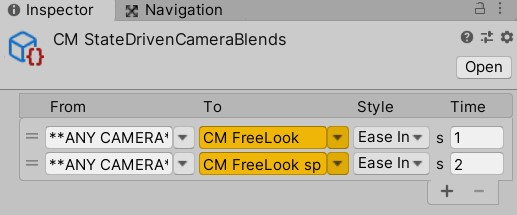
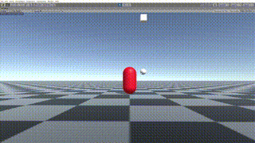
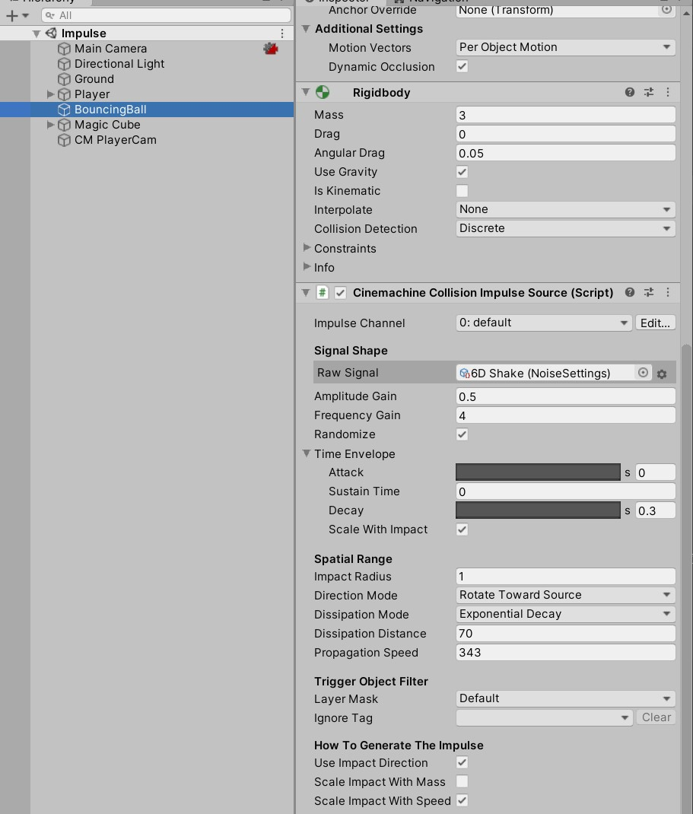
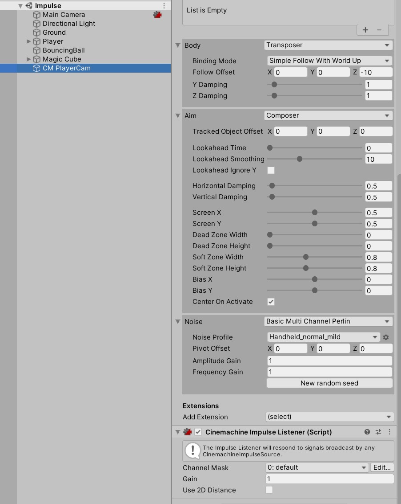
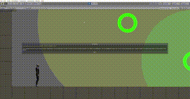
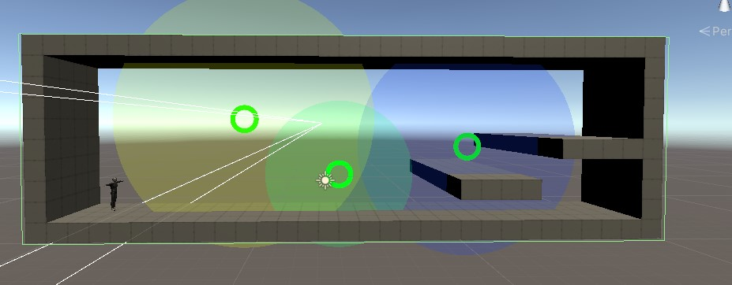

# Cinemachine 2.6 Sample

## 前提

#### Cinemachineのベースの考え方

`CinemachineBrain`というコンポーネントが実際にUnityのCameraコンポーネントを動かすものです。

動く先の指定を `CinemachineVirtualCamera` などの仮想カメラとなるコンポーネントが指定して、それを`CinemachineBrain`が優先度などのパラメーターを加味してCameraに映し出すような作りになっています。
仮想カメラはCameraコンポーネントはありませんが仮想カメラのTransform等をみてBrainが映し出します。

`CinemachineVirtualCamera` 以外にも
- CinemachineStateDrivenCamera
- CinemachineFreeLook

などの複数のコンポーネントを使い分けつつ仮想カメラを配置して挙動を制御していきます。

## StateDrivenCamera


### 概要
Animatorの状態遷移によってCameraを切り替えるもの

- 歩いているとマウスで操作したカメラワークになる
- 走っているとキャラクターを下から見上げる角度に変わる

をComponentの設定で指定できるもの

### 各オブジェクトの設定

Hierarchyは

<pre>
├── MainCamera
├── 3rdPersonController (子オブジェクト省略)
├── Directional Light
├── Environment (子オブジェクト省略)
└── CM StateDrivenFreeLook
    ├── CM FreeLook
    └── CM FreeLook sprint
</pre>

という風になっています。

MainCameraにはCinemachineを使う際の中枢となる `CinemachineBrain` が追加されています。

`CM StateDrivenFreeLook` はAnimatorのどのStateを見てVirtualCameraの切り替えを行うのか設定できます。

UnityEditorのMenuにある `Cinemachine > Create State-Driven Camera` がベースとなっています。



シンプルな構成を確認したいときは新しいSceneを作成してCreateすると良いと思います。

`CM StateDrivenFreeLook` には対象となるAnimatorとStateによってどのCameraを使用するのか設定しています。



Custom BlendsというところにScriptableObjectが設定されていますが、これはカメラを切り変える際のパラメーターが設定できます。



仮想カメラが切り替わる際のEasingや秒数が指定できます。また特定のカメラから特定のカメラへの遷移も個別に設定できるようになっています。

`CinemachineStateDrivenCamera` がメインの処理となりますが同じGameObjectに `CinemachineCollider` というコンポーネントがあります。Cameraに収める対象のオブジェクトが壁などでCameraに映らないようなことが起こると自動的にCameraに収めてくれるコンポーネントになります。

[【Unity】【Cinemachine】対象が障害物に隠れた時に対象が映る位置にカメラをいい感じに移動するCinemachine Collider](https://light11.hatenadiary.com/entry/2019/07/25/200547)

というブログなどを見るとパラメーターがどう反映するのか確認できます。

`CM FreeLook` と `CM FreeLook sprint` は `CinemachineFreeLook` Componentを付けてパラメーターが違うオブジェクトになります。それにより見え方が変わっています。

## Impulse



### 概要

衝撃を通知するオブジェクトに近づくとカメラが距離や威力によって揺れるものです。

### 各オブジェクトの設定

Hierarchyは

<pre>
├── MainCamera
├── Directional Light
├── Ground
├── Player (子オブジェト省略)
├── BouncingBall
├── Magic Cube (子オブジェト省略)
└── CM PlayerCam
</pre>

MainCameaには相も変わらず `CinemachineBrain` です。そしてCM PlayerCam には `CinemachineVirtualCamera` という標準な構成です。

今回のキモである衝撃の扱いについては、BouncingBallとCM PlayerCamにあるコンポーネントで表現できます。

BouncingBallには `Cinemachine Collision Impulse Source`



CM PlayerCamには `Cinemachine Impulse Listener` が設定されています。



Impulseの設定はSourceの方で設定します。

Raw Signalでどういう風に揺らすのか設定できます。SignalSourceAsset.csというclassを継承したScriptableObjectを設定すれば、XYZ毎にアニメーションカーブを設定して揺れ方を変えることが可能です。

`Amplitude Gain` と `Frequency Gain` でカメラの揺れる威力などを調整できます。

## CameraMagnets



### 概要

設定したObjectが範囲内にいると、元々対象としているObjectも含めてカメラに収めるようにする。
また、壁(指定した範囲)外を表示しないように収めている。

### 各オブジェクトの設定

Hierarchyは

<pre>
├── CamCollider
├── MainCamera
├── Environment (子オブジェト省略)
├── CM vcam2D
├── Directional Light (1)
├── 3rdPersonController (子オブジェト省略)
├── TargetGroup1
└── CameraMagnets
    ├── CameraMagnet
    ├── CameraMagnet(1)
    └── CameraMagnet(2)
</pre>

となっています。
まず指定した範囲を収めている処理から説明します。
CamColliderにて `Polygon Collider 2D` で壁をなぞるように値を入れています。



上記のように設定したColliderをCM vcam2Dに追加されている `Cinemachine Confiner` のInspectorに設定します。


これによってColliderで設定した範囲内をカメラに収めることができます。

次に設定したObjectに近づいた時にカメラをフォーカスさせる方法です。
Cinemachineで用意されている `CinemachineTargetGroup` というコンポーネントと自前で少しだけcsを書いているようです。


`CinemachineTargetGroup` に近づいたらカメラに収めたい対象のTransformを入れておきます。

<details><summary>CameraMagnetTargetController.cs</summary><div>

```
using System.Collections;
using System.Collections.Generic;
using Cinemachine;
using UnityEngine;

public class CameraMagnetTargetController : MonoBehaviour
{
    public CinemachineTargetGroup targetGroup;

    private int playerIndex;
    private CameraMagnetProperty[] cameraMagnets;
    // Start is called before the first frame update
    void Start()
    {
        cameraMagnets = GetComponentsInChildren<CameraMagnetProperty>();
        playerIndex = 0;
    }

    // Update is called once per frame
    void Update()
    {
        for (int i = 1; i < targetGroup.m_Targets.Length; ++i)
        {
            float distance = (targetGroup.m_Targets[playerIndex].target.position - 
                              targetGroup.m_Targets[i].target.position).magnitude;
            if (distance < cameraMagnets[i-1].Proximity)
            {
                targetGroup.m_Targets[i].weight = cameraMagnets[i-1].MagnetStrength * 
                                                  (1 - (distance / cameraMagnets[i-1].Proximity));
            }
            else
            {
                targetGroup.m_Targets[i].weight = 0;
            }
        }
    }
}
```

</div></details>

<details><summary>CameraMagnetProperty.cs</summary><div>

```
using System.Collections;
using System.Collections.Generic;
using UnityEngine;

[ExecuteInEditMode]
public class CameraMagnetProperty : MonoBehaviour
{
    [Range(0.1f, 50.0f)]
    public float MagnetStrength = 5.0f;
    
    [Range(0.1f, 50.0f)]
    public float Proximity = 5.0f;

    public Transform ProximityVisualization;

    [HideInInspector] public Transform myTransform;

    void Start()
    {
        myTransform = transform;
    }
    void Update()
    {
        if (ProximityVisualization != null)
            ProximityVisualization.localScale = new Vector3(Proximity * 2.0f, Proximity * 2.0f, 1);
    }
}
```

</div></details>

Cinemachineのコンポーネントではない追加されていたcsは上記です。要約すると操作Objectからの距離をみてTargetGroupに設定してあるTargetのWeightを変更するものになります。

Weightの数値が上がることによってCameraに収める対象物として認識されます。それによってgifのような動作となります。